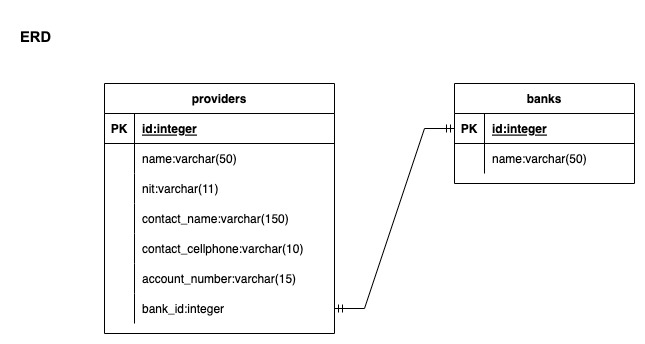
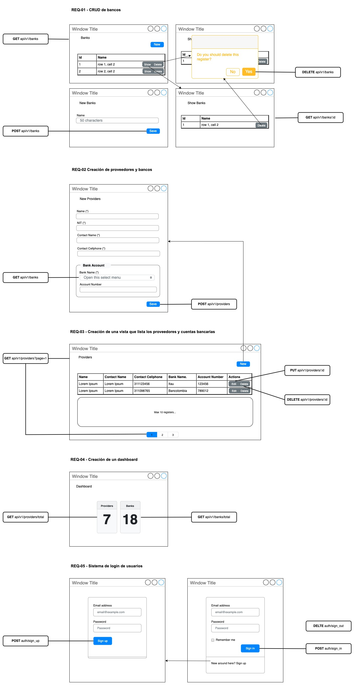

# Provider Plus Banks API

### * Run project using docker-compose
### Steps for installation

1. Please download docker-compose for your OS (Linux or Mac).
2. Run docker-compose:
```bash
docker-compose up --build
```
3. Run database and migrations:
```bash
docker-compose run --rm api rails db:create db:migrate
```
4. Prepare test database:
```bash
docker-compose run --rm api rails db:test:prepare
```
5. Run all unit tests
```bash
docker-compose run --rm api rspec
```
6. Finally if want to see the routes created
```bash
docker-compose run --rm api rails routes
```

---

## Documentation Base

### * Data Model


### Code Organization by layers (Clear Architecture)

[comment]: <> (![code_organization]&#40;code_organization.png&#41;)

### * Git Flow Used
```
git checkout main
git pull origin main -r
git checkout -b [feature improve fixbug]/RQ-[SEQUENCE]
git pull origin [feature improve fixbug]/RQ-[SEQUENCE]
```

### * Commands to continue project
* How to create models
```bash
docker-compose run --rm api rails g model Joke body:text
```

* How to create controllers
```bash
docker-compose run --rm api rails g controller Joke
```

---

## *Pending criteria (Missing)*

1. Separate business logic in interactors to registrations and sessions controllers
2. Integrate this API in frontend project



## *Recommendations*

* If you have any problem locally you can also try the project on [Heroku](https://provider-plus-banks.herokuapp.com/)